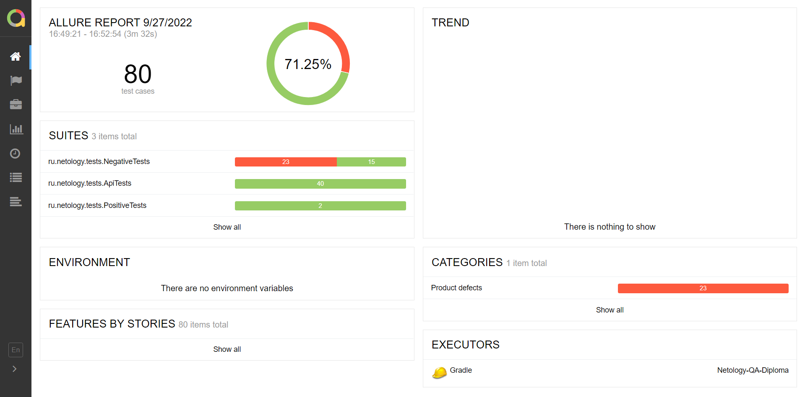

## Краткое описание
Было произведено автоматические тестирование сервиса для покупки посредством онлайн-покупки и оформления кредита.

Придерживаясь плана были составлены UI-тесты, тесты взаимодействия с БД и API-тесты.

### Тестовое окружение:
* Windows 10 PRO, Версия 21H1, Сборка 19043.1889.
* Версия Java: 11.0.16
* БД: MySQL 8

### Предусловия тестирования:
В качестве основных тестируемых данных, разработчиками были предоставлены номера валидных и невалидных карт. 
Оставшаяся часть тестируемых данных была сгенерированна посредством вспомогательных библиотек.

## Результаты и сводка:
### Количество тест-кейсов: 
Общее количество тест-кейсов составило: **80**. 
* Позитивные сценарии: **4**.
* Негативные сценарии: **76**.
* Процент успешных тестов: **71%**.
* Процент отрицательных тестов: **29%**.

### Дополнение:
* По итогам тестирования был сгенерирован отчёт Allure Report.

### Общие рекомендации:
* Устранить баги и несоответствия указанные в "Issues".
* Разработать и сформировать документацию по взаимодействую с БД.
* Добавить уникальные селекторы для дальнейшего тестирования и упрощения работы с полями.